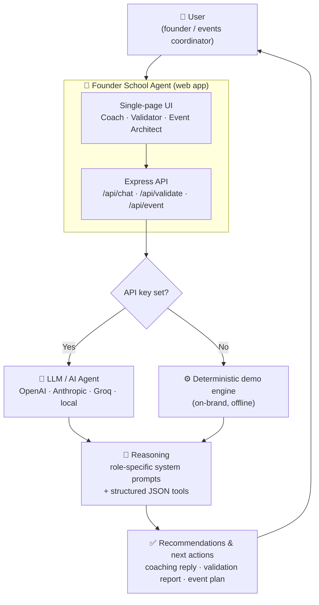
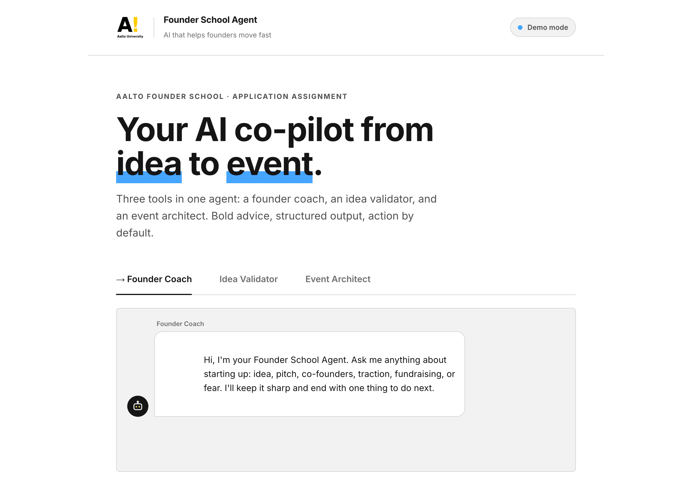
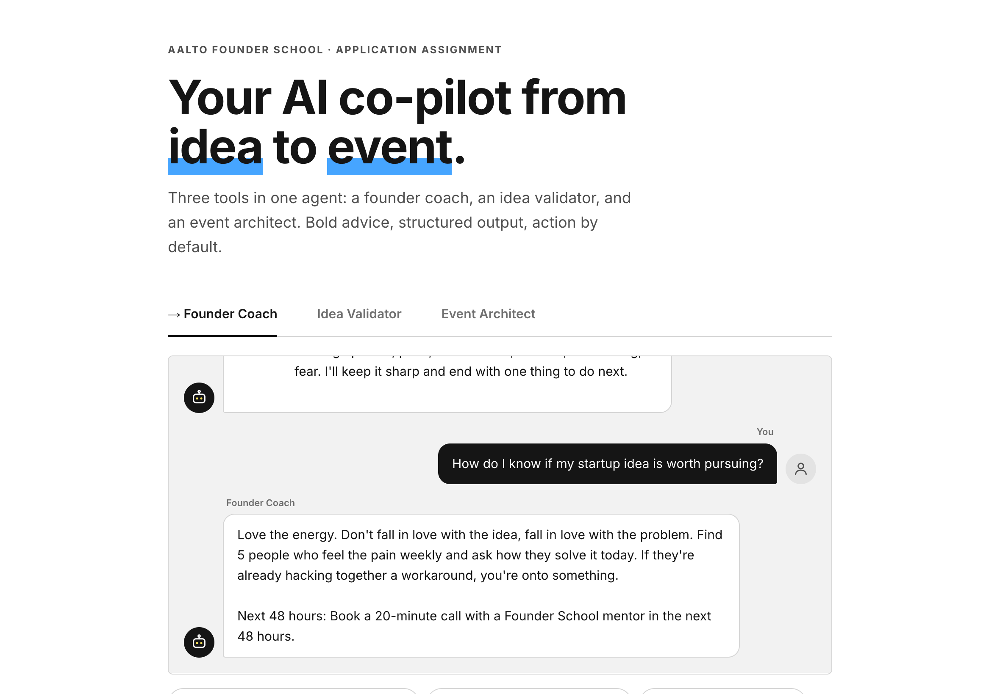
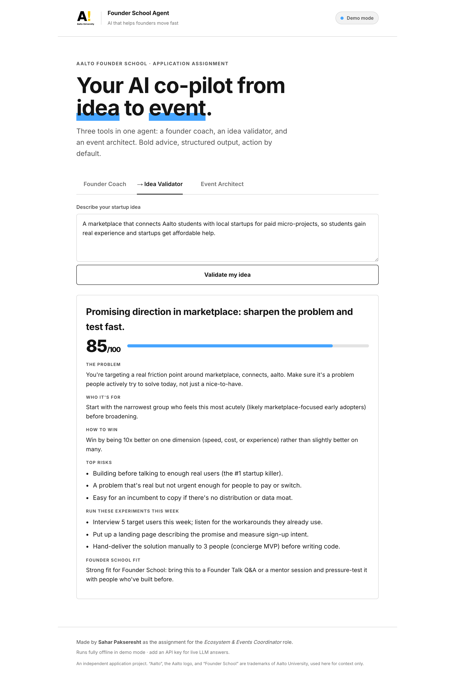
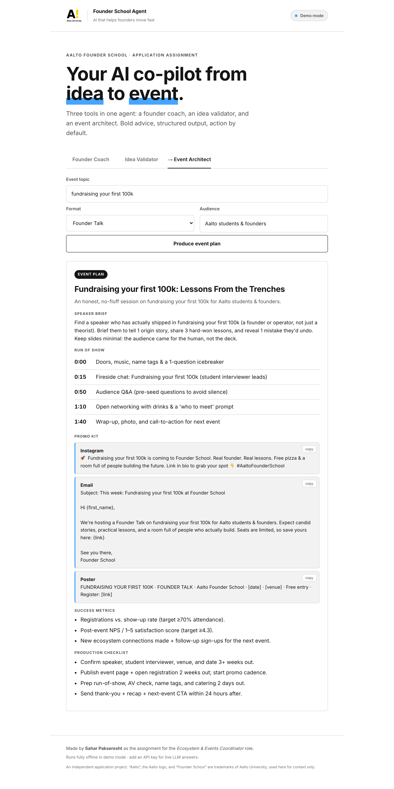
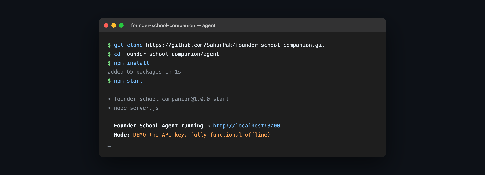

<div align="center">

# Founder School Agent

### An AI agent that helps founders move from *idea* to *action* to *event*.

**Built by [Sahar Pakseresht](https://github.com/SaharPak) as the application project for the
*Ecosystem & Events Coordinator* role at [Aalto University Founder School](https://www.aalto.fi/en/founder-school).**

[](https://nodejs.org)
[](https://expressjs.com)
[](#-running-locally)
[](./LICENSE)

### [▶️ Try the live demo →](https://founder-school-agent.onrender.com)

*Free to try, no login required. (First load may take ~50s while the free instance wakes up.)*

[Overview](#-overview) · [Features](#-features) · [Architecture](#-architecture-overview) · [Run locally](#-running-locally) · [Screenshots](#-screenshots) · [Demo video](#-demo-video) · [Deploy](./DEPLOYMENT.md)

</div>

---

> *"If you are interested in this role, make it yours! Make use of your agency, ambition
> and energy to proactively produce something… Aalto Founder School is for people of action."*
> — from the job posting

So instead of writing about what I *would* do, I shipped working software that does it.

---

## 🚀 Overview

**Founder School Agent** is a runnable AI web app that acts as a co-pilot for early-stage
founders and the people who support them. It bundles three tools into one agent:

1. A **Founder Coach** that gives bold, action-first advice.
2. An **Idea Validator** that turns a raw idea into structured, honest feedback.
3. An **Event Architect** that produces a complete, ready-to-ship plan for a Founder Talk or
   workshop in seconds.

It runs **fully offline with a single command** (no API key required) and seamlessly upgrades to
live LLM answers the moment you add a key. The entire project is intentionally lightweight so a
reviewer can clone it, run it, and understand it in under five minutes.

## 🎯 Problem Statement

Startup ecosystems run on two scarce resources: **founder momentum** and **operator time**.

- **Founders stall** between having an idea and taking the next concrete step. They get generic
  advice, over-analyze, and lose weeks before talking to a single real user.
- **Ecosystem and events teams are small and fast-moving.** Producing a high-quality event —
  topic, speaker brief, run-of-show, promo copy, success metrics — is repetitive, time-consuming
  work that eats into the time that should go toward people and relationships.

Both problems share a root cause: too much friction between *intent* and *action*.

## 💡 Solution

Founder School Agent removes that friction with a single AI agent that always pushes toward a
concrete next step:

- It coaches founders to **act in the next 48 hours**, not to ruminate.
- It validates ideas with **cheap experiments you can run this week**, not vague encouragement.
- It compresses **hours of event production into seconds**, giving a small team real leverage.

The design philosophy is *idea → working software*: ship something real, then let reality tell you
what to build next.

## ✨ Features

| Tool | What it does | Why it matters |
| --- | --- | --- |
| 💬 **Founder Coach** | A conversational mentor in Founder School's bold, action-first voice. Streams its reply token by token and always ends with one concrete next step. | Empowering future founders is the heart of the role. |
| 🔍 **Idea Validator** | Turns a raw idea into structured JSON: problem, audience, value proposition, top risks, a fit score, and cheap experiments to run this week. | Helps the community move faster and fail cheaper. |
| 🎤 **Event Architect** | Generates a full event plan: title, tagline, speaker brief, run-of-show, promo kit (Instagram + email + poster), success metrics, and a production checklist. | Directly mirrors the day-to-day of the events role. |

**Under the hood:**

- **Zero-setup demo mode** — a deterministic, on-brand engine means every feature works without any
  API key, account, or billing.
- **Provider-agnostic LLM layer** — works with OpenAI, Anthropic (Claude), OpenRouter, Groq, Azure,
  or a local Ollama / LM Studio server. Same code, swap the env vars.
- **Production-shaped** — API keys stay server-side, requests time out, and structured tools return
  validated JSON with a defensive fallback.
- **No build step** — vanilla JS frontend styled with Aalto's real design tokens. Fast to read, run,
  and trust.

## 🧭 Example Use Cases

- **A first-time founder** asks the Coach *"I'm scared to launch, what do I do?"* and gets a calm,
  motivating answer plus a single 48-hour action.
- **A student with a rough idea** pastes it into the Validator and instantly sees the real problem,
  the right first audience, the biggest risks, and three experiments to run before Friday.
- **An events coordinator** types *"fundraising your first €100k"* into the Event Architect and walks
  away with a complete Founder Talk plan — speaker brief, run-of-show, promo copy, and metrics — ready
  to publish.

> More worked examples with real inputs and outputs live in **[docs/EXAMPLES.md](./docs/EXAMPLES.md)**.

## 🏗️ Architecture Overview

The agent follows a simple, robust pattern: every request tries the live LLM first and gracefully
falls back to a deterministic on-brand engine, so the product is **never broken** even with no key.



For a deeper walkthrough of the request lifecycle, design decisions, and trade-offs, see
**[docs/ARCHITECTURE.md](./docs/ARCHITECTURE.md)**.

## 🛠️ Tech Stack

| Layer | Choice | Why |
| --- | --- | --- |
| Runtime | **Node.js 20+** | Native `fetch`, top-level `await`, built-in `.env` loading. |
| Server | **Express** | Minimal, well-understood, easy to read. |
| Frontend | **Vanilla JS + HTML + CSS** | No build step, no framework lock-in, instant to run. |
| AI | **Any OpenAI-compatible API** | Provider-agnostic; demo engine when no key is present. |
| Deploy | **Render / Hugging Face Spaces** | One-click blueprint included. See [DEPLOYMENT.md](./DEPLOYMENT.md). |

## 📦 Installation

**Requirements:** [Node.js 20+](https://nodejs.org).

```bash
git clone https://github.com/SaharPak/founder-school-agent.git
cd founder-school-agent/agent
npm install
```

## ▶️ Running Locally

```bash
npm start
# → open http://localhost:3000
```

That's it. No API key required — the app runs in **demo mode** and every feature works.

To enable **live LLM answers**, add a key (any OpenAI-compatible provider):

```bash
# OpenAI
OPENAI_API_KEY=sk-... npm start

# or Anthropic (Claude) via its OpenAI-compatible endpoint
OPENAI_API_KEY=sk-ant-... \
OPENAI_BASE_URL=https://api.anthropic.com/v1 \
OPENAI_MODEL=claude-haiku-4-5-20251001 \
npm start
```

The header pill shows whether you're in **Demo** or **Live** mode. See
[`agent/.env.example`](./agent/.env.example) for all options.

## 📸 Screenshots

| Home screen | Founder Coach (live conversation) |
| --- | --- |
|  |  |

| Idea Validator | Event Architect |
| --- | --- |
|  |  |

**Terminal — runs with one command, zero config:**



## 🎬 Demo Video

A **90-second screen recording** of the live app (real GPT-4o-mini answers) walking through all three
tools: **[▶️ watch the demo](./docs/demo/founder-school-agent-demo.mp4)**.

Prefer to click around yourself? The app is live: **[try it →](https://founder-school-agent.onrender.com)**.

The full narrated voice-over script and shot list are in **[DEMO.md](./DEMO.md)**.

## 🔭 Future Improvements

- Persist past coaching sessions and idea reports per user.
- Export event plans to PDF / Notion / Google Calendar in one click.
- A lightweight RAG layer grounded in Founder School's own resources and past events.
- Analytics dashboard for the events team (attendance, NPS, ecosystem connections).

The full roadmap is in **[docs/FUTURE.md](./docs/FUTURE.md)**.

## 🗂️ Repository Structure

```
founder-school-agent/
├── README.md                ← you are here
├── DEMO.md                  ← 90-second demo video script
├── DEPLOYMENT.md            ← deploy to Render / Hugging Face Spaces
├── ELEVATOR_PITCH.md        ← 30-second spoken pitch
├── LINKEDIN_POST.md         ← ready-to-post project announcement
├── SHORT_DESCRIPTION.md     ← resume / portfolio blurb
├── LICENSE                  ← MIT
├── render.yaml              ← one-click Render deploy blueprint
├── docs/
│   ├── ARCHITECTURE.md      ← how the system works
│   ├── EXAMPLES.md          ← realistic prompts and outputs
│   ├── FUTURE.md            ← roadmap and future improvements
│   └── screenshots/         ← app screenshots used in this README
└── agent/                   ← the AI agent (runnable web app)
    ├── server.js            ← Express app + 3 API routes (LLM → demo fallback)
    ├── lib/
    │   ├── llm.js           ← provider-agnostic OpenAI-compatible client
    │   └── demoEngine.js    ← deterministic on-brand responder (offline mode)
    ├── public/              ← single-page UI (HTML, CSS, JS, assets)
    ├── .env.example         ← configuration template
    └── README.md            ← agent-level technical notes
```

## 📄 License

Released under the [MIT License](./LICENSE).

This is an independent application project. *"Aalto"*, the Aalto logo, and *"Founder School"* are
trademarks of Aalto University and are used here for context only.

---

<div align="center">

**Idea → working software. That's the loop I'd bring to the Founder School team.**

Made with intent by **Sahar Pakseresht**

</div>
