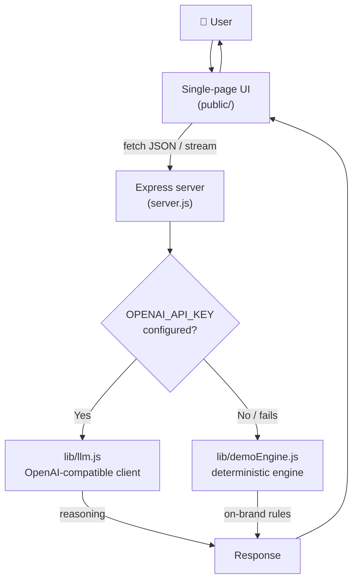

# Architecture

This document explains how **Founder School Agent** works, the decisions behind it, and the
trade-offs I made. The goal was a project that is small enough to read in one sitting yet shaped
like real production software.

## High-level flow

The core idea is a **try-live-then-fall-back** pattern. Every endpoint attempts a real LLM call when
a key is present, and on any failure (no key, timeout, bad JSON, network error) it returns a
deterministic, on-brand response instead. The product is therefore *never* broken.

## Components

### 1. Frontend — `agent/public/`

A single-page app with no build step:

- `index.html` — semantic markup, three tab panels (Coach, Validator, Event Architect).
- `styles.css` — a clean light theme built on Aalto University's real design tokens (Inter
  typeface, `#151515` ink, highlight blue `#46A5FF`, yellow `#f7e159`, arrow-prefixed links).
- `app.js` — handles tab switching, streaming chat rendering, form submission, and safe Markdown
  rendering. No framework, no bundler.

The frontend talks to the backend over `fetch`. The chat endpoint is **streamed** so the coach's
reply renders token by token, which feels alive and responsive.

### 2. API server — `agent/server.js`

A small Express app exposing four routes:

| Route | Method | Purpose |
| --- | --- | --- |
| `/api/status` | GET | Reports whether the backend is in Live or Demo mode. |
| `/api/chat` | POST | Founder Coach. Streams a plain-text reply. |
| `/api/validate` | POST | Idea Validator. Returns structured JSON. |
| `/api/event` | POST | Event Architect. Returns structured JSON. |

Each structured route uses a role-specific **system prompt** that constrains the model to return
strict JSON matching a known schema. The server then extracts and parses that JSON defensively
(`safeJson`), so a slightly malformed model response never crashes the app.

The server auto-loads `agent/.env` via Node's built-in `process.loadEnvFile`, so `npm start` picks
up a key with no extra flags and no third-party dotenv dependency.

### 3. LLM layer — `agent/lib/llm.js`

A thin, provider-agnostic client for any endpoint that speaks the OpenAI `/chat/completions`
schema. It exposes:

- `llmStatus()` — whether a key is configured, plus the active model and base URL.
- `callLLM()` — a single non-streaming completion (used by the structured tools), with a 30-second
  abort timeout and optional JSON response-format hint.
- `streamLLM()` — an async generator that yields tokens from the Server-Sent Events stream (used by
  the chat tool).

Because it only depends on the OpenAI-compatible contract, the **same code** works with OpenAI,
Anthropic (Claude), OpenRouter, Groq, Azure OpenAI, or a local Ollama / LM Studio server. You swap
three environment variables, nothing else.

### 4. Demo engine — `agent/lib/demoEngine.js`

A deterministic, rule-based responder. It is **not** trying to imitate an LLM — it is a deliberate
fallback so the project is fully demoable with zero setup:

- `coachReply()` matches the question against intent keywords (idea, pitch, team, traction, events,
  fear) and returns an on-brand answer that always ends with a 48-hour action.
- `validateIdea()` extracts keywords, derives an encouraging-but-honest score, and fills the same
  JSON schema the LLM would.
- `designEvent()` assembles a complete, realistic event plan from the topic, format, and audience.

When `OPENAI_API_KEY` is set, these functions are never called.

## Key design decisions

| Decision | Why |
| --- | --- |
| **Demo mode by default** | A reviewer should be able to `npm install && npm start` and use every feature immediately. The demo must never depend on someone else's credentials or budget. |
| **Server-side keys only** | API keys are read from the environment on the server and never exposed to the browser. |
| **Provider-agnostic** | Avoids vendor lock-in and makes the project cheap to run on free or local models. |
| **Structured JSON tools** | The Validator and Event Architect return validated objects, so the UI can render rich, reliable layouts instead of free text. |
| **Dependency-light** | One runtime dependency (Express). Faster to install, easier to audit, nothing to be suspicious of. |
| **No em dashes in model output** | System prompts forbid em dashes for a consistent, human writing voice across both Live and Demo modes. |

## Request lifecycle (example: Idea Validator)

1. User submits an idea in the UI.
2. `app.js` POSTs `{ idea }` to `/api/validate`.
3. `server.js` builds a strict JSON system prompt and calls `callLLM()` if a key exists.
4. On success, `safeJson()` parses the model output and the server returns `{ result, source: "llm" }`.
5. On any failure, the server returns `{ result: validateIdea(idea), source: "demo" }`.
6. `app.js` renders the structured result (score ring, problem, audience, risks, experiments).

The same shape applies to every tool, which keeps the codebase predictable and easy to extend.
